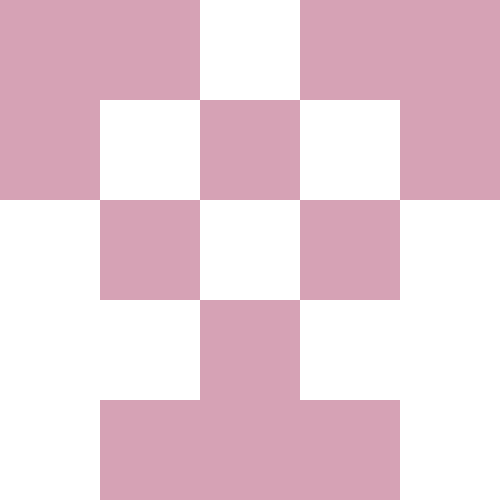

# Hash visualization

> [!WARNING]
> Project created for practicing in rust, code might not meet good rust standarts!

## Content

- Github Identicon recreation

### Github Identicon

 

 

> [!NOTE] 
> My implementation does not match with actual Github's implementation. 

Resulting image is 5x5, so we need 25 bits + color.

Image is mirrored (first two columns) therefore 2x5 + 1x5 = 15 bits.

Basically we create unsigned 16 bit integer (u16) it should be enough to draw all bits.

For the color we can use u16 integer as RGB565 (16 bit).

To create u16 we just hash input text.

Then using u16 we just draw it in following fashion:

                            abcba
                            defed
    abcd efji ghkl mnop ->  ghihg   
                            jklkj
                            mnonm

    color(RBG 565): 
            R: abcde G: efjigk B: lmnop

TODO:
- [ ] Stack Overflow's (Gravatars) or jdenticon 
- [ ] Blur hash
